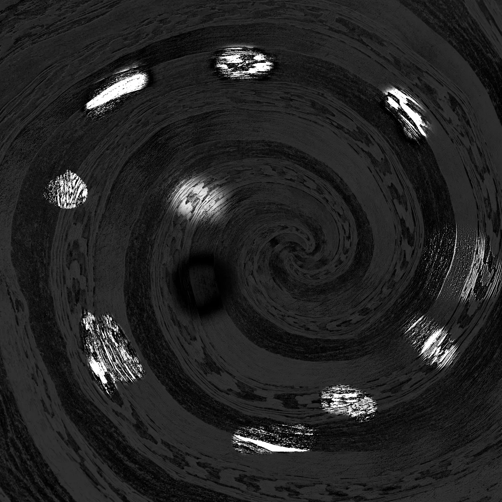

# SHERLOQ Web — browser and WordPress community adaptation

**SHERLOQ is the work of [Guido Bartoli and the original contributors](https://github.com/GuidoBartoli/sherloq).** I refer to the original project for its introduction, history, research references and upstream development.

## Why this is a separate repository

This is a derivative adaptation of SHERLOQ, not a claim to have created the original project. My account already owns [the macOS fork](https://github.com/Kinkazma/sherloq). GitHub did not offer a destination for another fork under the same account, either from Guido's repository or from my existing fork: both belong to the same fork network. I therefore keep the web adaptation in this separate repository so the two versions can have their own code, documentation and examples. The absence of GitHub's “forked from” badge is a hosting constraint, not a change in authorship or attribution.

**Original project: [GuidoBartoli/sherloq](https://github.com/GuidoBartoli/sherloq). macOS adaptation: [Kinkazma/sherloq](https://github.com/Kinkazma/sherloq). Browser adaptation: this repository.** Original notices and licenses remain with their components.

I started with [my macOS adaptation](https://github.com/Kinkazma/sherloq), then worked on bringing its image-analysis workflows into a browser workspace embedded in WordPress. This repository contains the interface, browser engine, native kernel sources, converted model resources and the scripts needed to reconstruct the locked dependency library.

Much of the implementation was produced with AI assistants. My role has been to direct the work, question and correct implementation choices, explore possible solutions, shape the interface, and review part of the calculations and results. That process does not make every method independently validated. I describe the evidence and its limits alongside the code. SHERLOQ and the integrated research methods retain their original authors and component licenses.

[Source layout and reconstruction](docs/BUILD.md) · [Validation and performance limits](docs/VALIDATION.md) · [Example inputs](examples/README.md) · [Credits and licenses](docs/ATTRIBUTION.md)

## What I have adapted

| Area | Implementation in this delivery |
| --- | --- |
| Browser workspace | Independent tool documents, tabs, tiled/cascaded layouts, French/English controls, theme, favorites, zoom and portable settings |
| WordPress integration | A block or shortcode embeds the workspace; WordPress serves the interface while computation runs in the browser |
| Tool interfaces | A 50-entry catalogue with individual and automatic workflows; tool presence is not a claim that every browser, input and algorithm combination has been qualified |
| Runtime and models | Locked browser runtimes, WebAssembly kernels and converted model resources, with explicit source identities and SHA-256 manifests |
| Resource loading | Large dependencies requested as needed, verified pieces, bounded concurrent downloads and optional caching |
| Local resource library | Ordinary files in their original formats, folder reconnection and standard TAR import/export |
| Results | Tool-specific views and exports; changing display controls can reuse a completed result where supported |

The interface source is **0.14.0**, from `6fb6e874ef7a1c36af22f2dc3ca2383085d9e249`. The engine snapshot is **0.35.0-export.1**, from `70473081aab0767f9ea10613001e444847e2d9db`. The runtime lock also retains earlier engine slots used by specific tools; a single version number does not replace that inventory.

## What the distribution checks establish

The supplied Chrome 154, Firefox 155 and WebKit 26.6 records cover two distinct local origins: resource transport, a large model range spanning two pieces, a real engine operation and lossless export on synthetic 67 × 65 pixels, reuse of a local resource library, and independently read standard TAR archives.

Startup transferred 2,363,985 application bytes with no remote resource requests in those checks. This is a startup measurement, not an inference-speed claim. The records do not establish public-host performance or the scientific accuracy of every catalogue method. See [the exact scope](docs/VALIDATION.md).

## Performance work and remaining limits

Calculation time, memory use and model loading still need substantial optimization. I would start with reproducible measurements of expensive tools, cold versus cached model preparation, CPU/GPU transfers and repeated allocations, and cancellation or recovery during large jobs. Improvements must retain scientific parameters and compare actual output arrays against a fixed reference.

The transport admits at most two pieces and 128 MiB of declared payload at once. Hashing, response copies, caches and engine allocations add to that amount; it is not a physical-RAM cap. Browser storage can be evicted, and hardware/browser differences matter. [Priorities and evidence](docs/VALIDATION.md).

## Example material

These are the same original and edited inputs used to document my macOS work. Edit-reference images are visual comparisons and are never detector inputs. The previews below show input material, not browser analysis results.

Spiral — original, edited input and my edit reference

| Original | Edited input | My edit reference |
| --- | --- | --- |
|  |  |  |

Street Photo — original, edited input and my edit reference

| Original | Edited input | My edit reference |
| --- | --- | --- |
|  |  |  |

[Full-resolution files and provenance](examples/README.md).

## Interpretation and privacy

Maps, groups and geometric matches are analysis outputs, not automatic verdicts of manipulation. Responses outside known edits and missed edits must remain visible in example discussions.

This application adds no image-upload endpoint or analysis telemetry. Dependencies are downloaded separately from image processing. This statement does not describe the logs or behavior of a hosting site, its other WordPress plugins, optional font services or GitHub.
